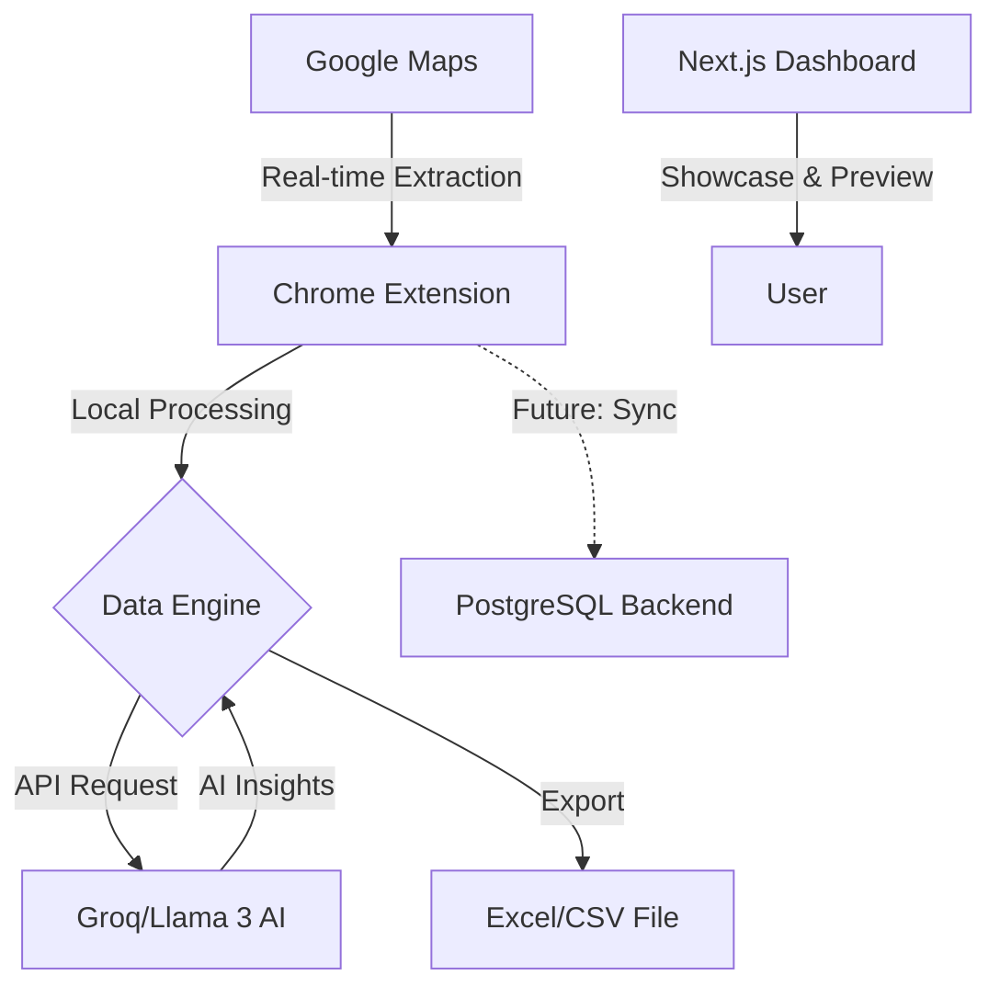

# SaaSquatch Intelligence 

[](https://saasquatch-leads-scraper.vercel.app/)
[](https://opensource.org/licenses/MIT)
[](https://nextjs.org/)

**SaaSquatch Intelligence** is a high-performance lead generation and sales intelligence engine built for modern sales teams. It transforms raw Google Maps business data into actionable sales strategies using real-time extraction and AI-driven insights.

Developed as part of the **Caprae Capital AI Readiness Challenge**, this platform bridges the gap between simple data scraping and true business intelligence.

---

##  Key Features

- **Real-Time Extraction**: A custom Chrome Extension that scrapes live business data directly from Google Maps search results.
- **AI Lead Classification**: Automatically categorizes leads into **Hot**, **Warm**, or **Cold** based on reviews, ratings, and digital presence.
- **Elite SEO Architecture**: Optimized with **Next.js Server Components**, **JSON-LD Structured Data**, and automated **Sitemaps** for maximum search visibility.
- **High-Performance UI**: Blazing fast load times using optimized images (`next/image`) and Framer Motion animations.
- **Business Gap Insights**: Identifies specific weaknesses in a lead's digital footprint (e.g., missing booking systems, outdated websites).
- **Personalized Cold Call Scripts**: Generates high-converting, data-driven outreach scripts tailored to each specific business.
- **Premium UI/UX**: A sophisticated, dark-mode dashboard built with Next.js for seamless data visualization and management.
- **Export Ready**: Instant export to **Excel (.xlsx)** and **CSV** for immediate CRM integration.

---

##  Tech Stack

### Frontend (Intelligence Dashboard)
- **Framework**: Next.js 15 (App Router - Full Server Component Architecture)
- **SEO**: JSON-LD (SoftwareApplication), Automated Sitemap, Robots.txt
- **Performance**: Next/Image (LCP Optimized), Turbopack
- **UI/UX**: React 19, Tailwind CSS 4, Framer Motion
- **Icons**: Lucide React
- **Deployment**: Vercel (Serverless Architecture)

### Chrome Extension (The Scraper)
- **API**: Web Extensions API (Manifest V3)
- **Logic**: Vanilla JavaScript with optimized DOM traversal
- **AI Engine**: Llama 3.3 (via Groq API) for real-time sales strategy generation

### Production Design (Proposed)
- **Backend**: FastAPI or Node.js
- **Database**: PostgreSQL (Prisma ORM)
- **Caching**: Redis for deduplication and API response caching

---

##  System Architecture



---

##  Installation & Setup

### 1. Intelligence Dashboard (Frontend)
```bash
# Clone the repository
git clone https://github.com/ahmedrazakhann/saasquatch-intelligence.git
cd saasquatch-intelligence/frontend

# Install dependencies
npm install

# Run development server
npm run dev
```
The dashboard will be available at `http://localhost:3000`.

### 2. Chrome Extension Setup (Developer Mode)
To use the lead extraction tool, you must load the extension manually:

1. Open **Google Chrome** and navigate to `chrome://extensions/`.
2. Toggle **Developer mode** (top-right corner) to ON.
3. Click the **Load unpacked** button.
4. Navigate to the project root and select the `extension` folder.
5. The SaaSquatch icon will now appear in your browser toolbar.

> [!TIP]
> To enable AI-generated scripts, add your **Groq API Key** directly in the extension popup and click the checkmark to save it.

---

##  Business Value & Design Rationale

SaaSquatch was designed with a "Strategy-First" approach. Most lead generators provide a list of emails; SaaSquatch provides a **reason to call**.

### 1. Data Field Normalization
We don't just grab text. We normalize phone numbers, extract clean URLs, and parse complex address strings into searchable City/Country fields.

### 2. The "Gap" Methodology
By analyzing the delta between a business's reputation (reviews/rating) and their digital infrastructure (website presence/booking flow), we identify high-intent sales opportunities.

### 3. SEO-Driven Growth
The landing page is built using **Next.js Server Components** and injected with **JSON-LD (Schema.org)** structured data to ensure elite search engine indexing. This allows for rich snippets in search results, showcasing ratings and software details directly on Google.

### 4. Technical Performance
We utilize **LCP (Largest Contentful Paint)** optimization for the hero section and automated caching for static assets, ensuring a near-perfect Lighthouse score and superior user experience.

---

##  License

Distributed under the MIT License. See `LICENSE` for more information.

---

##  Contact

**Project Lead** - [@ahmedrazakhann](https://github.com/ahmedrazakhann)  
**Challenge** - Caprae Capital AI Readiness Pre-Screening  
**Demo** - [saasquatch-leads-scraper.vercel.app](https://saasquatch-leads-scraper.vercel.app/)
